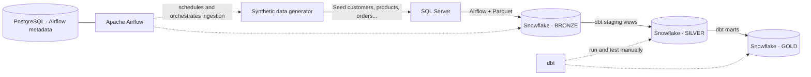
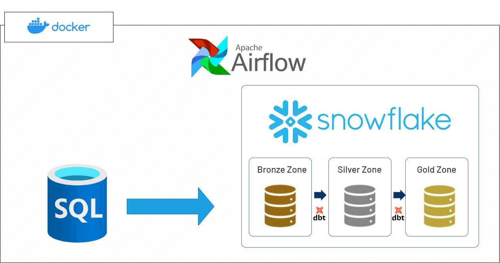
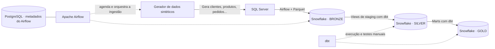

# E-commerce Data Pipeline

An end-to-end portfolio project that generates synthetic e-commerce data, orchestrates ingestion with Apache Airflow, lands raw data in Snowflake, and transforms it with dbt into analytics-ready layers.

> **Project status:** SQL Server-to-Snowflake ingestion is orchestrated by Airflow. dbt transformations and tests are run separately from Airflow.

## Architecture





### Data layers

| Layer | Purpose | Implementation |
| --- | --- | --- |
| **Bronze** | Raw copies of the SQL Server source tables, including extraction timestamps. | Airflow extracts to Parquet and loads `RAW_*` tables into `ERP_DATABASE.BRONZE`. |
| **Silver** | Cleaned staging views and dbt snapshots that retain source history. | dbt creates staging views and the `SNAPSHOT_CUSTOMERS` and `SNAPSHOT_PRODUCTS` history tables in `ERP_DATABASE.SILVER`. |
| **Gold** | Type 2 customer/product dimensions and an order-level fact table. | dbt creates `DIM_CUSTOMERS`, `DIM_PRODUCTS`, and `FCT_ORDERS` tables in `ERP_DATABASE.GOLD`. |

### Gold marts

| Model | Grain | Contents |
| --- | --- | --- |
| `dim_customers` | One row per customer version | Customer identity, contact, and location history; includes `customer_sk`, `valid_from`, `valid_to`, and `is_current`. |
| `dim_products` | One row per product version | Product, pricing, inventory, and category history; includes `product_sk`, `valid_from`, `valid_to`, and `is_current`. |
| `fct_orders` | One row per order | Order totals, shipping, item-line count, total quantity, item subtotal, and payment details, linked to the customer version effective on the order date. Item and payment data are aggregated before joining so they do not multiply order rows. |

Customer and product history is maintained by dbt snapshots (SCD Type 2). Customer changes use the source `updated_at` timestamp. Product snapshots check product attributes and joined category attributes, so those changes are captured the next time snapshots run. The first observed version starts at the source `created_at` when available; subsequent versions retain the snapshot's change timestamp.

## Technology stack

- **Apache Airflow 3.3.2** — scheduling and ingestion orchestration.
- **SQL Server 2022** — synthetic e-commerce source database.
- **Snowflake** — analytical warehouse and Bronze, Silver, and Gold schemas.
- **dbt Core + dbt-snowflake** — SQL transformations and data tests.
- **Docker Compose** — local orchestration for Airflow, PostgreSQL, and SQL Server.
- **Parquet + PyArrow** — columnar interchange format for ingestion.

## Repository layout

```text
.
├── data_font/
│   ├── DDL/                              # SQL Server reference DDL
│   └── fake_ingest_sqlserver_database/   # Synthetic data generator
├── dbt_ecommerce/
│   ├── models/
│   │   ├── staging/                     # Bronze sources and Silver models
│   │   └── marts/                       # Gold dimensions and facts
│   ├── snapshots/
│   └── macros/
├── docker/
│   ├── airflow/                         # Custom Airflow image
│   └── dags/                            # Seed and ingestion DAGs
├── docker-compose.yml
└── README.md
```

## Getting started

### Prerequisites

- Docker Desktop with Docker Compose.
- A Snowflake account, warehouse, and role with permission to create databases, schemas, stages, and tables in the target database.
- dbt Core and the `dbt-snowflake` adapter installed locally to run transformations.

### 1. Configure local environment variables

Create a root `.env` file for Docker Compose. Provide values for the variables referenced in [`docker-compose.yml`](./docker-compose.yml), including:

- `POSTGRES_USER`, `POSTGRES_PASSWORD`, and `POSTGRES_DB`
- `MSSQL_SA_PASSWORD` and `MSSQL_PORT`
- `AIRFLOW_WWW_USER_USERNAME` and `AIRFLOW_WWW_USER_PASSWORD`
- `AIRFLOW_API_SECRET_KEY` and `AIRFLOW_API_AUTH_JWT_SECRET`
- Optional seed sizes: `FAKE_CATEGORIES`, `FAKE_CUSTOMERS`, `FAKE_PRODUCTS`, and `FAKE_ORDERS`

Use strong, unique values for passwords and generate **different random values** for the two Airflow API secrets. The SQL Server SA password must meet Microsoft's password complexity requirements. `.env` files are ignored by Git: **never commit credentials or paste them into this README**.

The standalone generator also supports a local `data_font/fake_ingest_sqlserver_database/.env`; it is not needed when the generator is run by Airflow, which receives its connection settings from Docker Compose.

### 2. Start the local services

From the repository root:

```powershell
docker compose up -d --build
docker compose ps
```

Airflow's initialization service creates the metadata schema and web user. Open [http://localhost:8080](http://localhost:8080) and sign in with the Airflow credentials configured in `.env`. Newly discovered DAGs may be paused on a fresh installation; enable them in the Airflow UI if necessary.

### 3. Configure the Snowflake Airflow connection

In **Airflow UI → Admin → Connections**, create a connection with:

| Field | Value |
| --- | --- |
| Connection ID | `snowflake` |
| Connection type | Snowflake |
| Account, username, password | Your Snowflake account credentials |
| Extra | Your Snowflake `warehouse` and `role` |

Grant the configured Snowflake role the privileges needed to create the database, schemas, stage, watermark table, and Bronze/Silver/Gold objects. Do not commit connection secrets.

### 4. Generate and ingest data

The `dag_seed_sqlserver` DAG runs every five minutes and is enabled automatically when first registered. On startup, the Airflow scheduler waits until SQL Server is healthy. The seed DAG creates/ensures the SQL Server schema, enables SQL Server Change Tracking on the six source tables, inserts a synthetic batch, then triggers `dag_sqlserver_to_snowflake_bronze` and waits for the complete run to succeed before finishing. The ingestion DAG uses Change Tracking to extract only inserted, updated, or deleted rows, stages those changes in Parquet, and applies them with Snowflake `MERGE`. The first run for each table (or an expired/missing watermark) performs a full reconciliation; processed versions are stored in `ERP_DATABASE.BRONZE.INGESTION_WATERMARKS`. After all six loads succeed, it triggers `dag_dbt_snapshots` and waits for its result. That DAG recreates Silver/Gold schemas and rebuilds staging, snapshots, and Gold. Only one seed run can be active at a time, so the next cycle does not overlap the previous load. After containers start, recovery begins on the next scheduled seed run (within about five minutes). Dropping `ERP_DATABASE` deletes its watermarks and snapshot history, so the next ingestion does a full reload from SQL Server; previously deleted SCD2 history cannot be reconstructed.

The snapshot DAG runs `dbt snapshot` using the existing Airflow `snowflake` connection. dbt compares each source row with the saved snapshot and creates a new SCD Type 2 version only when the configured customer or product attributes change. No change means no new version. The snapshot DAG can also be triggered manually from the Airflow UI.

The Bronze tables are `RAW_CUSTOMERS`, `RAW_CATEGORIES`, `RAW_PRODUCTS`, `RAW_ORDERS`, `RAW_ORDER_ITEMS`, and `RAW_PAYMENTS` in `ERP_DATABASE.BRONZE`.

### 5. Configure and run dbt

Create `~/.dbt/profiles.yml` (on Windows, `%USERPROFILE%\.dbt\profiles.yml`) with the Snowflake connection details. Keep the password in an environment variable rather than in the profile:

```yaml
dbt_ecommerce:
  target: dev
  outputs:
    dev:
      type: snowflake
      account: "<your-account>"
      user: "<your-user>"
      password: "{{ env_var('DBT_SNOWFLAKE_PASSWORD') }}"
      role: "<your-role>"
      database: ERP_DATABASE
      warehouse: "<your-warehouse>"
      schema: BRONZE
      threads: 4
```

Set `DBT_SNOWFLAKE_PASSWORD` in your local shell, then run from the repository root:

```powershell
dbt debug --project-dir dbt_ecommerce --profiles-dir "$HOME\.dbt"
dbt run --project-dir dbt_ecommerce --profiles-dir "$HOME\.dbt" --select staging
dbt test --project-dir dbt_ecommerce --profiles-dir "$HOME\.dbt" --select staging
dbt snapshot --project-dir dbt_ecommerce --profiles-dir "$HOME\.dbt"
dbt run --project-dir dbt_ecommerce --profiles-dir "$HOME\.dbt" --select path:models/marts
dbt test --project-dir dbt_ecommerce --profiles-dir "$HOME\.dbt" --select path:models/marts
```

After each successful Bronze ingestion, Airflow ensures the Silver and Gold schemas exist, builds Silver staging, runs the customer and product snapshots, and then rebuilds the Gold marts. Each step waits for the previous one to succeed. For manual execution, run `dbt run --select staging`, then `dbt snapshot`, followed by `dbt run --select path:models/marts`. Snapshots retain history only from their first run onward; changes that happened before snapshot history was initialized cannot be reconstructed automatically.

The profile's `schema: BRONZE` is the default schema; the project's schema-generation macro routes staging models and snapshots to `SILVER` and marts to `GOLD`. Bronze source definitions are in [`src_bronze.yml`](./dbt_ecommerce/models/staging/src_bronze.yml).

## Operational notes

- Airflow automates data generation, Bronze ingestion, SCD Type 2 snapshot capture, and Gold mart rebuilds.
- Staging models are views, dbt snapshots are history tables in Silver, and Gold marts are tables.
- SQL Server Change Tracking captures inserts, updates, and deletes for Bronze. The ingestion DAG copies only changed rows to a unique Parquet path, applies them with Snowflake `MERGE`, and advances each table's watermark in the same transaction. It performs a full reconciliation for a new/missing watermark or when SQL Server has already cleaned up changes older than the configured seven-day retention. The Bronze DAG allows one active run to avoid concurrent watermark updates. Datetimes are serialized as ISO strings in Parquet and loaded into Snowflake timestamp columns to avoid timestamp-unit corruption.
- The generator appends synthetic rows on each run and aligns each customer's creation date with their earliest generated order. Adjust the `FAKE_*` settings to control the size of each batch.
- `docker compose down` stops the services. Docker volumes preserve SQL Server and Airflow metadata; removing volumes deletes that local state.

## Validation performed

- The seed and Snowflake ingestion DAGs completed successfully after the timestamp and generated-date fixes.
- A controlled run completed all six Bronze table loads, then triggered the dbt snapshot DAG; the snapshot task completed successfully.
- The complete dbt build passed: 2 snapshots, 9 models, and 39 data tests (50 total successful results).
- Date-range checks passed across Silver and snapshot history. The only missing payment dates are for `PENDING` payments; all other payment dates are valid timestamps.
- Every Gold order row matched a customer dimension version effective on its order date.

## English / Português

See the full Portuguese guide below.

---

# Pipeline de Dados de E-commerce

Projeto de portfólio de engenharia de dados que gera dados sintéticos de e-commerce, orquestra a ingestão com Apache Airflow, carrega os dados brutos no Snowflake e os transforma com dbt em camadas prontas para análise.

> **Status do projeto:** A ingestão do SQL Server para o Snowflake é orquestrada pelo Airflow. As transformações e os testes do dbt são executados separadamente do Airflow.

## Arquitetura




### Camadas de dados

| Camada | Objetivo | Implementação |
| --- | --- | --- |
| **Bronze** | Cópias brutas das tabelas de origem do SQL Server, com data de extração. | Airflow extrai para Parquet e carrega tabelas `RAW_*` em `ERP_DATABASE.BRONZE`. |
| **Silver** | Views de staging limpas e snapshots dbt que preservam histórico. | dbt cria views de staging e as tabelas históricas `SNAPSHOT_CUSTOMERS` e `SNAPSHOT_PRODUCTS` em `ERP_DATABASE.SILVER`. |
| **Gold** | Dimensões SCD Type 2 de clientes/produtos e fato analítico no nível do pedido. | dbt cria as tabelas `DIM_CUSTOMERS`, `DIM_PRODUCTS` e `FCT_ORDERS` em `ERP_DATABASE.GOLD`. |

### Marts Gold

| Modelo | Granularidade | Conteúdo |
| --- | --- | --- |
| `dim_customers` | Uma linha por versão do cliente | Histórico de identificação, contato e localização; inclui `customer_sk`, `valid_from`, `valid_to` e `is_current`. |
| `dim_products` | Uma linha por versão do produto | Histórico do produto, preço, estoque e categoria; inclui `product_sk`, `valid_from`, `valid_to` e `is_current`. |
| `fct_orders` | Uma linha por pedido | Totais, frete, quantidade de itens, quantidade total, subtotal e pagamentos, ligado à versão do cliente válida na data do pedido. Itens e pagamentos são agregados antes dos joins para não multiplicar pedidos. |

O histórico de clientes e produtos é mantido por snapshots do dbt (SCD Type 2). Alterações de clientes usam o timestamp de origem `updated_at`. Para produtos, snapshots verificam atributos do produto e da categoria relacionada; as mudanças são capturadas na próxima execução dos snapshots. A primeira versão observada começa em `created_at` quando disponível; as versões seguintes usam o timestamp da alteração capturada pelo snapshot.

## Tecnologias

- **Apache Airflow 3.3.2** — agendamento e orquestração da ingestão.
- **SQL Server 2022** — banco de origem com dados sintéticos de e-commerce.
- **Snowflake** — data warehouse analítico e schemas Bronze, Silver e Gold.
- **dbt Core + dbt-snowflake** — transformações SQL e testes de dados.
- **Docker Compose** — ambiente local para Airflow, PostgreSQL e SQL Server.
- **Parquet + PyArrow** — formato colunar usado na ingestão.

## Estrutura do repositório

```text
.
├── data_font/
│   ├── DDL/                              # DDL de referência do SQL Server
│   └── fake_ingest_sqlserver_database/   # Gerador de dados sintéticos
├── dbt_ecommerce/
│   ├── models/
│   │   ├── staging/                     # Fontes Bronze e modelos Silver
│   │   └── marts/                       # Dimensões e fatos Gold
│   ├── snapshots/
│   └── macros/
├── docker/
│   ├── airflow/                         # Imagem customizada do Airflow
│   └── dags/                            # DAGs de geração e ingestão
├── docker-compose.yml
└── README.md
```

## Como executar

### Pré-requisitos

- Docker Desktop com Docker Compose.
- Conta Snowflake, warehouse e role com permissão para criar databases, schemas, stages e tabelas no banco de destino.
- dbt Core e o adaptador `dbt-snowflake` instalados localmente para executar as transformações.

### 1. Configure as variáveis de ambiente locais

Crie um arquivo `.env` na raiz para o Docker Compose. Preencha as variáveis referenciadas em [`docker-compose.yml`](./docker-compose.yml), incluindo:

- `POSTGRES_USER`, `POSTGRES_PASSWORD` e `POSTGRES_DB`
- `MSSQL_SA_PASSWORD` e `MSSQL_PORT`
- `AIRFLOW_WWW_USER_USERNAME` e `AIRFLOW_WWW_USER_PASSWORD`
- `AIRFLOW_API_SECRET_KEY` e `AIRFLOW_API_AUTH_JWT_SECRET`
- Tamanho opcional das cargas: `FAKE_CATEGORIES`, `FAKE_CUSTOMERS`, `FAKE_PRODUCTS` e `FAKE_ORDERS`

Use senhas fortes e únicas e gere valores aleatórios **diferentes** para os dois segredos da API do Airflow. A senha SA do SQL Server deve cumprir os requisitos de complexidade da Microsoft. Arquivos `.env` são ignorados pelo Git: **nunca envie credenciais ao repositório nem as cole neste README**.

O gerador executado diretamente também aceita um `.env` local em `data_font/fake_ingest_sqlserver_database/`; ele não é necessário quando o Airflow executa o gerador, pois o Docker Compose fornece as configurações de conexão.

### 2. Inicie os serviços locais

Na raiz do repositório:

```powershell
docker compose up -d --build
docker compose ps
```

O serviço de inicialização do Airflow cria o schema de metadados e o usuário web. Acesse [http://localhost:8080](http://localhost:8080) e entre com as credenciais do Airflow definidas no `.env`. Em uma instalação nova, as DAGs detectadas podem estar pausadas; se necessário, habilite-as pela interface do Airflow.

### 3. Configure a conexão do Airflow com o Snowflake

Na interface do Airflow, acesse **Admin → Connections** e crie uma conexão:

| Campo | Valor |
| --- | --- |
| Connection ID | `snowflake` |
| Connection type | Snowflake |
| Account, username, password | Credenciais da sua conta Snowflake |
| Extra | `warehouse` e `role` do Snowflake |

Conceda à role configurada os privilégios necessários para criar o banco, schemas, stage, tabela de watermark e objetos Bronze/Silver/Gold. Não envie segredos da conexão ao repositório.

### 4. Gere e ingira os dados

A DAG `dag_seed_sqlserver` roda a cada cinco minutos e é habilitada automaticamente quando registrada pela primeira vez. Na inicialização, o scheduler do Airflow aguarda o SQL Server ficar saudável. A DAG seed cria ou garante o schema no SQL Server, habilita Change Tracking nas seis tabelas de origem, insere uma carga sintética, dispara `dag_sqlserver_to_snowflake_bronze` e aguarda a execução completa terminar com sucesso. A ingestão usa Change Tracking para extrair somente linhas inseridas, alteradas ou excluídas, stageia as mudanças em Parquet e aplica `MERGE` no Snowflake. A primeira execução de cada tabela (ou watermark ausente/expirado) faz uma reconciliação completa; as versões processadas ficam em `ERP_DATABASE.BRONZE.INGESTION_WATERMARKS`. Após o sucesso das seis cargas, dispara `dag_dbt_snapshots` e aguarda seu resultado. Essa DAG recria os schemas Silver/Gold e reconstrói staging, snapshots e Gold. Somente uma execução seed pode ficar ativa por vez. Depois de subir os containers, a recuperação começa na próxima execução agendada da seed (em até cerca de cinco minutos). Apagar `ERP_DATABASE` apaga os watermarks e o histórico dos snapshots, então a próxima ingestão recarrega a origem inteira; o histórico SCD2 já excluído não pode ser reconstruído.

A DAG de snapshots executa `dbt snapshot` usando a conexão Airflow existente `snowflake`. O dbt compara cada linha de origem com o snapshot salvo e cria uma nova versão SCD Type 2 somente quando os atributos configurados de cliente ou produto mudam. Sem alteração, nenhuma versão nova é criada. A DAG também pode ser disparada manualmente pela interface do Airflow.

As tabelas Bronze são `RAW_CUSTOMERS`, `RAW_CATEGORIES`, `RAW_PRODUCTS`, `RAW_ORDERS`, `RAW_ORDER_ITEMS` e `RAW_PAYMENTS`, no schema `ERP_DATABASE.BRONZE`.

### 5. Configure e execute o dbt

Crie `~/.dbt/profiles.yml` (no Windows, `%USERPROFILE%\.dbt\profiles.yml`) com os dados da conexão Snowflake. Mantenha a senha em uma variável de ambiente, não no arquivo de perfil:

```yaml
dbt_ecommerce:
  target: dev
  outputs:
    dev:
      type: snowflake
      account: "<sua-conta>"
      user: "<seu-usuario>"
      password: "{{ env_var('DBT_SNOWFLAKE_PASSWORD') }}"
      role: "<sua-role>"
      database: ERP_DATABASE
      warehouse: "<seu-warehouse>"
      schema: BRONZE
      threads: 4
```

Defina `DBT_SNOWFLAKE_PASSWORD` no terminal local e execute, a partir da raiz do repositório:

```powershell
dbt debug --project-dir dbt_ecommerce --profiles-dir "$HOME\.dbt"
dbt run --project-dir dbt_ecommerce --profiles-dir "$HOME\.dbt" --select staging
dbt test --project-dir dbt_ecommerce --profiles-dir "$HOME\.dbt" --select staging
dbt snapshot --project-dir dbt_ecommerce --profiles-dir "$HOME\.dbt"
dbt run --project-dir dbt_ecommerce --profiles-dir "$HOME\.dbt" --select path:models/marts
dbt test --project-dir dbt_ecommerce --profiles-dir "$HOME\.dbt" --select path:models/marts
```

Após cada ingestão Bronze concluída com sucesso, o Airflow garante que os schemas Silver e Gold existam, cria a staging Silver, executa os snapshots de clientes e produtos e, em seguida, reconstrói os marts Gold. Cada etapa aguarda o sucesso da anterior. Para executar manualmente, rode `dbt run --select staging`, depois `dbt snapshot` e, por fim, `dbt run --select path:models/marts`. Os snapshots preservam o histórico somente a partir da primeira execução; alterações anteriores à inicialização não podem ser reconstruídas automaticamente.

O `schema: BRONZE` no perfil é o schema padrão; a macro do projeto direciona os modelos de staging e snapshots para `SILVER` e os marts para `GOLD`. As fontes Bronze estão definidas em [`src_bronze.yml`](./dbt_ecommerce/models/staging/src_bronze.yml).

## Observações operacionais

- O Airflow automatiza a geração dos dados, a ingestão Bronze, a captura de snapshots SCD Type 2 e a reconstrução dos marts Gold.
- Os modelos staging são views, snapshots dbt são tabelas históricas na Silver e os marts Gold são tabelas.
- O Change Tracking do SQL Server captura inclusões, alterações e exclusões para a Bronze. A DAG copia somente as linhas alteradas para um caminho Parquet único, aplica as mudanças com `MERGE` e avança o watermark da tabela na mesma transação. Faz reconciliação completa quando o watermark é novo/ausente ou quando o SQL Server já limpou alterações anteriores à retenção configurada de sete dias. A DAG Bronze permite uma execução ativa para evitar atualizações concorrentes de watermark. Datas são serializadas como strings ISO no Parquet e carregadas em colunas timestamp no Snowflake para evitar corrupção da unidade temporal.
- O gerador acrescenta dados sintéticos a cada execução e alinha a data de criação de cada cliente ao seu primeiro pedido gerado. Ajuste as variáveis `FAKE_*` para controlar o tamanho de cada carga.
- `docker compose down` para os serviços. Os volumes Docker preservam os dados locais do SQL Server e os metadados do Airflow; removê-los apaga esse estado local.

## Validações realizadas

- As DAGs de geração e ingestão Snowflake concluíram com sucesso após as correções de timestamps e datas dos dados sintéticos.
- Uma execução controlada concluiu as seis cargas Bronze e acionou a DAG de snapshots dbt; a tarefa de snapshot terminou com sucesso.
- O build completo do dbt passou: 2 snapshots, 9 modelos e 39 testes (50 resultados bem-sucedidos no total).
- Os testes de datas passaram na Silver e no histórico dos snapshots. Datas de pagamento ficam nulas somente para pagamentos `PENDING`; as demais são timestamps válidos.
- Todas as linhas de pedidos Gold foram associadas a uma versão da dimensão de clientes válida na data do pedido.
